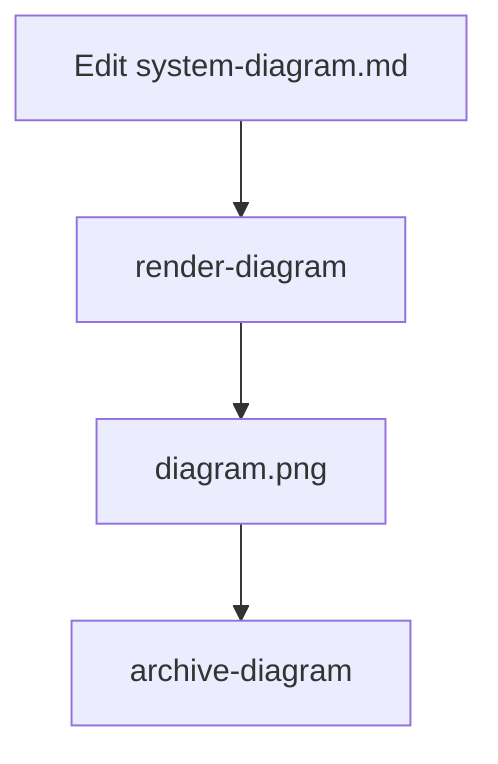

# Diagram as Code

Diagram as Code is a small portable workflow for editing Mermaid diagrams in Markdown, rendering them to images, watching for changes, and archiving stable snapshots.

## Install

1. Clone or download this repository.
2. Run the installer from the repo root:

```bash
./install.sh
```

3. When prompted, choose a diagram workspace:
   - use the current directory
   - select an existing folder
   - create a new folder
4. The installer writes a workspace config file and starter `system-diagram.md` if needed.
5. Make sure `~/bin` is on your `PATH` if your shell has not loaded it yet.

## Requirements

- Node.js
- `@mermaid-js/mermaid-cli`
- `nodemon`
- Puppeteer setup for `mmdc`

If Puppeteer cannot find a browser automatically, set:

```bash
export PUPPETEER_EXECUTABLE_PATH="/path/to/chrome"
```

## Usage

Render the current diagram:

```bash
render-diagram
```

Watch for changes and rerender automatically:

```bash
watch-diagram
```

Archive the current diagram and reset the working file:

```bash
archive-diagram
```

You can also use the Makefile from the repository root:

```bash
make render
make watch
make archive
```

## Example Mermaid Diagram



## Workflow

1. Start from `templates/system-diagram.md`.
2. Edit `system-diagram.md` in any workspace.
3. Render to `diagram.png` or `diagram.svg`.
4. Watch the file while iterating.
5. Archive a stable version into `past-diagrams/`.

See `docs/workflow.md` for the full flow.

## Configuration

These environment variables keep the workflow portable:

- `DIAGRAM_FILE` defaults to `system-diagram.md`
- `DIAGRAM_OUTPUT` defaults to `diagram.png`
- `DIAGRAM_ARCHIVE_DIR` defaults to `past-diagrams`

The installer writes a workspace config file at `.diagram-as-code.env` in the folder you choose. The scripts automatically discover it from the current directory or any parent directory.

## Repository Layout

- `scripts/` contains the runnable shell scripts.
- `templates/` contains the starter diagram.
- `examples/` contains a usage example.
- `docs/` contains the workflow guide.

## License

MIT
