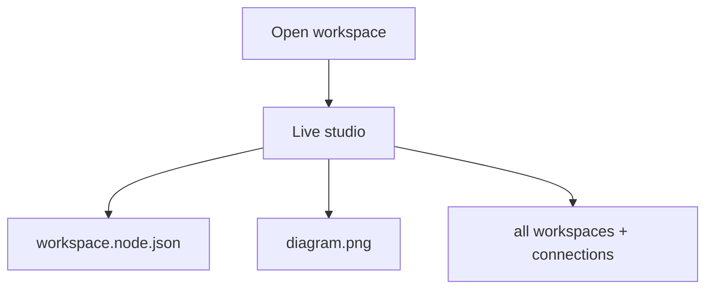

# Diagram as Code

Diagram as Code is a small portable workflow for editing node workspaces in a live split studio.

Each workspace is a saved node model plus its rendered image, so you can come back later, reopen it, and keep editing with live preview.

## Install

1. Clone or download this repository.
2. Run the installer from the repo root:

```bash
./install.sh
```

3. Make sure `~/bin` is on your `PATH` if your shell has not loaded it yet.
4. Use `diagram-workspace open` to search saved workspaces, `diagram-workspace new` to browse folders and create one, `diagram-workspace clear` to reset one, or `diagram-workspace delete` to remove one.
5. Opening or creating a workspace now launches the live studio right away, with the source on one side, the rendered preview on the other, and a visual workspace graph alongside it.
6. Use `diagram` for the interactive launcher that can open workspaces, create one, delete one, or list saved workspaces.

## Requirements

- Node.js
- `@mermaid-js/mermaid-cli`
- `nodemon`
- Puppeteer setup for `mmdc`

If Puppeteer cannot find a browser automatically, set:

```bash
export PUPPETEER_EXECUTABLE_PATH="/path/to/chrome"
```

## Usage

List initialized workspaces:

```bash
list-workspaces
```

Create, open, or delete a workspace:

```bash
diagram-workspace open
diagram-workspace new
diagram-workspace clear
diagram-workspace delete
diagram-workspace list
```

Use the interactive launcher for the full loop:

```bash
diagram
```

If you forget the available commands, run `diagram --help` or `diagram-workspace --help`.

Opening a workspace launches the live studio so you can edit the source, click layer chips to zoom between shell/summary/inner, see the preview update, and connect workspaces together from one place.

## Example Mermaid Diagram



## Workflow

1. Start from a workspace node JSON file.
2. Edit `workspace.node.json` in any node workspace.
3. Render to `diagram.png` or `diagram.svg`.
4. Watch the file while iterating.
5. Archive a stable version into `past-diagrams/`.

See `docs/workflow.md` for the full flow.

## Configuration

These environment variables keep the workflow portable:

- `DIAGRAM_FILE` defaults to `workspace.node.json`
- `DIAGRAM_OUTPUT` defaults to `diagram.png`
- `DIAGRAM_ARCHIVE_DIR` defaults to `past-diagrams`

`diagram-workspace` writes a workspace config file at `.diagram-as-code.env` in the folder you choose. New workspaces use the same file pair:

- `workspace.node.json`
- `diagram.png`
- `workspace-studio.html`
- `past-diagrams/`

When you create or open a workspace, the starter node JSON is written and rendered right away so the output file is ready immediately.

Legacy workspaces may still use `system-diagram.md`, but the node workspace model is now the default.

It also keeps a small registry at `~/.config/diagram-as-code/workspaces`, so `diagram-workspace` and `list-workspaces` can show already-initialized workspaces.

## Repository Layout

- `scripts/` contains the runnable shell scripts.
- `templates/` contains the starter diagram.
- `examples/` contains a usage example.
- `docs/` contains the workflow guide.

## License

MIT
