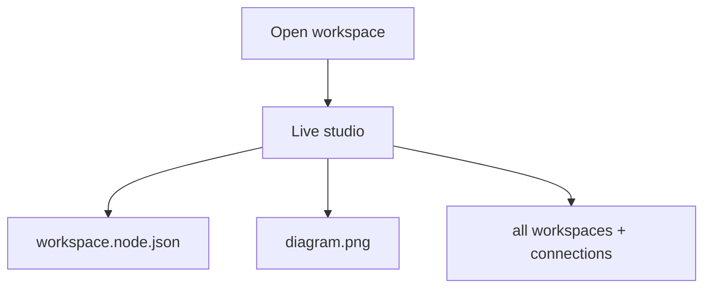

# Workflow

`Diagram as Code` keeps one editable node workspace file and one generated image in sync, inside a live studio that also shows the full workspace graph.

Think of each workspace as a saved node model plus its rendered image. Opening a workspace takes you straight into the live workspace studio, which shows the editor, preview, workspace list, and connections together.

## Files

- `workspace.node.json` is the source of truth for new node workspaces.
- `diagram.png` is the default rendered artifact.
- `past-diagrams/` stores archived snapshots.

## Typical Loop

1. Open a workspace.
2. Edit `workspace.node.json`.
3. Watch `diagram.png` update alongside the source in the live studio.
4. Use the workspace list to switch nodes and the connection form to link them together.
5. Keep iterating in the node workspace as the preview refreshes.

## Archiving

The studio stays in sync automatically because opening the workspace starts the live editing server for you.

## Workspace Config

Run `diagram-workspace open` to search saved workspaces, `diagram-workspace new` to browse folders and create one, or `diagram-workspace delete` to remove one. It writes a `.diagram-as-code.env` file into the workspace you are configuring.
That bootstrap step also creates the starter `workspace.node.json`, makes `past-diagrams/`, and renders the initial output file so the workspace is ready to preview immediately.
Run `diagram` when you want one interactive menu for workspace selection plus create, open, delete, and list actions.

Each workspace uses the same root-level pair:

- `workspace.node.json`
- `diagram.png`
- `workspace-studio.html`
- `past-diagrams/`

The command lets you:

- search initialized workspaces by name or path
- browse folders and create a new workspace
- delete an initialized workspace
- open the editable studio for the source, preview, workspace list, and graph

If the workspace does not already have a starter node file, the command creates one for you.

The runtime scripts search for that file in the current directory and then walk upward through parent directories, so you can launch the commands from subdirectories without losing the workspace settings.

The command also keeps a registry at `~/.config/diagram-as-code/workspaces` so it can show initialized folders as numbered options the next time you run it.

You can inspect that registry directly with:

```bash
list-workspaces
```

Or use the unified interactive launcher:

```bash
diagram
```

## Mental Model


