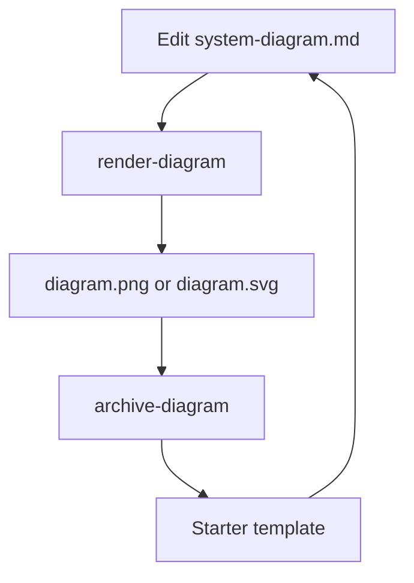

# Workflow

`Diagram as Code` keeps one editable Markdown source file and one generated image in sync.

Think of each workspace as a saved Mermaid source file plus its rendered image. `watch-diagram` is the live preview loop for that pair.

## Files

- `system-diagram.md` is the source of truth.
- `diagram.png` is the default rendered artifact.
- `past-diagrams/` stores archived snapshots.

## Typical Loop

1. Edit `system-diagram.md`.
2. Run `render-diagram` to regenerate `diagram.png`.
3. Use `watch-diagram` when you want automatic rerenders.
4. Run `archive-diagram` when the diagram reaches a stable checkpoint.
5. Keep iterating in the starter template after the archive is saved.

## Archiving

Archiving preserves both the markdown source and the rendered output before resetting the active file back to the starter template. That keeps the working diagram focused while still retaining the history.

## Render Path

- `render-diagram.sh` reads the first Mermaid code block in `system-diagram.md`.
- It renders at high resolution with `mmdc`.
- It respects `PUPPETEER_EXECUTABLE_PATH` when Puppeteer needs an explicit browser path.
- It supports `diagram.png` by default and `diagram.svg` when you choose that extension.

## Environment Variables

- `DIAGRAM_FILE` overrides the source markdown file.
- `DIAGRAM_OUTPUT` overrides the generated image path.
- `DIAGRAM_ARCHIVE_DIR` overrides the archive destination.

## Workspace Config

Run `diagram-workspace open` to reopen a workspace or `diagram-workspace new` to create one. It writes a `.diagram-as-code.env` file into the workspace you are configuring.
Run `diagram` when you want one interactive menu for workspace selection plus render, watch, archive, and list actions.
When you choose watch from that menu, it opens the active `system-diagram.md` in your OS editor and starts the live preview loop in the same workspace.

Each workspace uses the same root-level pair:

- `system-diagram.md`
- `diagram.png`
- `past-diagrams/`

The command lets you:

- use the current directory
- select an initialized workspace
- select an existing folder
- create a new folder

If the workspace does not already have a starter `system-diagram.md`, the command creates one for you.

The runtime scripts search for that file in the current directory and then walk upward through parent directories, so you can launch the commands from subdirectories without losing the workspace settings.

The command also keeps a registry at `~/.config/diagram-as-code/workspaces` so it can show initialized folders as numbered options the next time you run it.

You can inspect that registry directly with:

```bash
list-workspaces
```

Or use the unified interactive launcher:

```bash
diagram
```

## Mental Model


