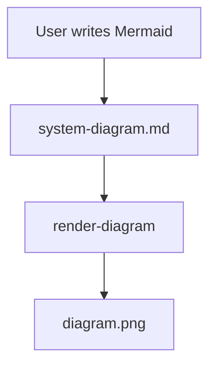

# Example Diagram

Use this file as a quick reference for the expected markdown shape.

The workflow is intentionally small:

1. Edit `system-diagram.md`.
2. Render a fresh image.
3. Archive the old version when you want a snapshot.
